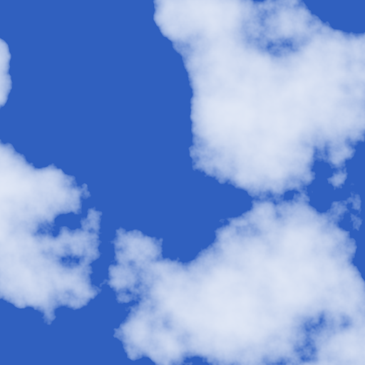

# perlin

Perlin Noise JavaScript library

Generate beautiful clouds in real time:

* 1D, 2D, 3D and 4D
* Uses WebGL for real time rendering
* CPU version also available
* generates random permutations and gradients from a persistent XorShift PRNG